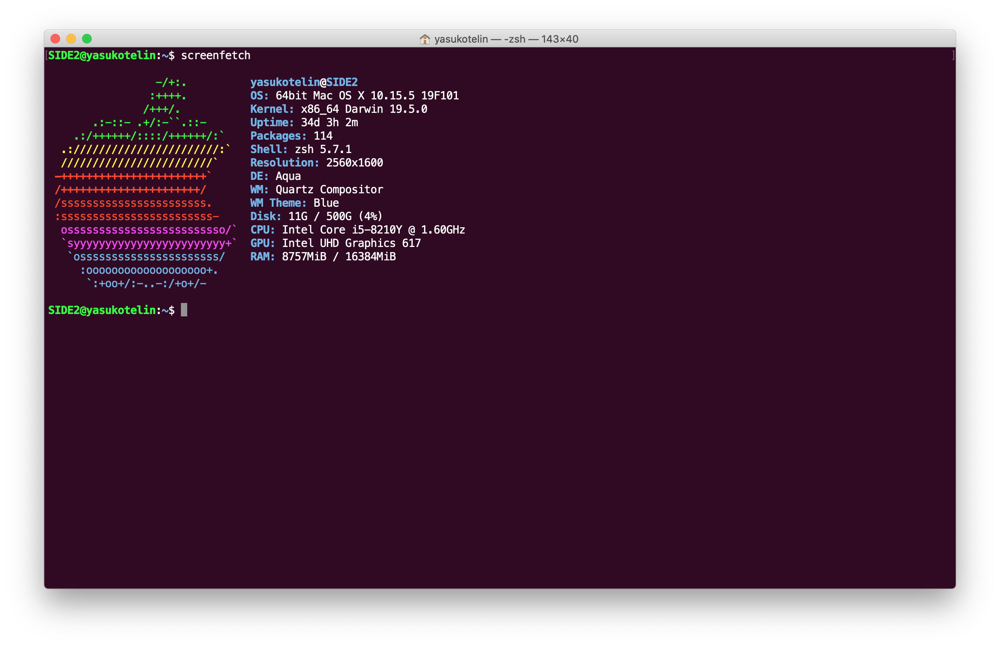

# Ubuntu Terminal.app

---

This is Ubuntu color profile for Terminal.app of MacOS!

## Install

1. Download `Ubuntu.terminal` from [Release page](https://github.com/yasukotelin/ubuntu-terminal-app).
2. Terminal.app > Preference > Profile > Import

## Author

yasukotelin
